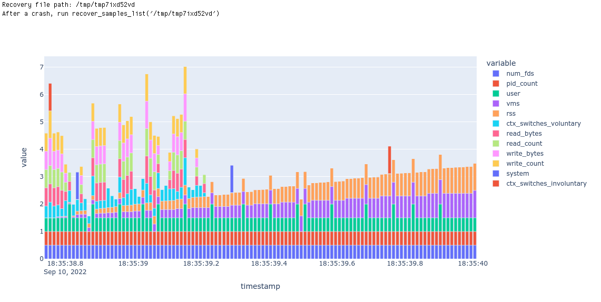

# How to use this
- First, install the ipynb module, which will let you import this notebook as if it were a Python module.  You need to install a specific fork of the ipynb module which ignores cell magics, like this:
```bash
pip install 'git+https://github.com/mister-average/ipynb.git@mister-average-ignore-cell-magic'
```
- Also make sure that Pandas and Plotly are installed<br><br>
- Then in your notebook, import everything from the getrusage_background_sampler_magic module like this:
```python
from ipynb.fs.defs.getrusage_background_sampler_magic import *
```
- Next, start any cell in your notebook with this magic:
```python
%%getrusage_in_background .03 name_of_dataframe_variable_that_will_store_samples
```
- This will start a background process that collects samples of the entire process tree spawned by this notebook, and display a chart or two when the cell finishes.  The two arguments are required:<br><br>
 - The first floating point argument is the time in seconds between samples
 - The second string argument is the name you wish to give to the variable that will hold the dataframe of data samples that are collected.  You can perform further analysis of that dataframe in subsequent cells of your notebook.
    

**In case** your noteboook crashes, take note of the recovery file statement that is printed out just as your cell starts executing.  It will look like this:
```
Recovery file path: /some/path
After a crash, run recover_samples_list('/some/path')
```
After restarting your notebook and re-running the import statement above, you can execute that function call to display charts of the samples that were collected up to the point of your notebook crash.  That function call will also return the dataframe of samples.

# Tests/demos

## Basic test


```python
%%getrusage_in_background .1 basic_test_samples_df
time.sleep(3)
```


```python
basic_test_samples_df
```


<div>
<table border="1" class="dataframe">
  <thead>
    <tr style="text-align: right;">
      <th></th>
      <th>timestamp</th>
      <th>pid_count</th>
      <th>user</th>
      <th>system</th>
      <th>read_count</th>
      <th>write_count</th>
      <th>read_bytes</th>
      <th>write_bytes</th>
      <th>rss</th>
      <th>vms</th>
      <th>ctx_switches_voluntary</th>
      <th>ctx_switches_involuntary</th>
      <th>num_fds</th>
    </tr>
  </thead>
  <tbody>
    <tr>
      <th>0</th>
      <td>2022-09-10 18:34:10.462739</td>
      <td>1</td>
      <td>NaN</td>
      <td>NaN</td>
      <td>NaN</td>
      <td>NaN</td>
      <td>NaN</td>
      <td>NaN</td>
      <td>144809984</td>
      <td>2893950976</td>
      <td>NaN</td>
      <td>NaN</td>
      <td>62</td>
    </tr>
    <tr>
      <th>1</th>
      <td>2022-09-10 18:34:10.565919</td>
      <td>1</td>
      <td>0.0</td>
      <td>0.0</td>
      <td>0.0</td>
      <td>0.0</td>
      <td>0.0</td>
      <td>0.0</td>
      <td>144809984</td>
      <td>2893950976</td>
      <td>0.0</td>
      <td>0.0</td>
      <td>62</td>
    </tr>
    <tr>
      <th>2</th>
      <td>2022-09-10 18:34:10.670812</td>
      <td>1</td>
      <td>0.0</td>
      <td>0.0</td>
      <td>0.0</td>
      <td>0.0</td>
      <td>0.0</td>
      <td>0.0</td>
      <td>144809984</td>
      <td>2893950976</td>
      <td>0.0</td>
      <td>0.0</td>
      <td>62</td>
    </tr>
    <tr>
      <th>3</th>
      <td>2022-09-10 18:34:10.774538</td>
      <td>1</td>
      <td>0.0</td>
      <td>0.0</td>
      <td>0.0</td>
      <td>0.0</td>
      <td>0.0</td>
      <td>0.0</td>
      <td>144809984</td>
      <td>2893950976</td>
      <td>0.0</td>
      <td>0.0</td>
      <td>62</td>
    </tr>
    <tr>
      <th>4</th>
      <td>2022-09-10 18:34:10.878595</td>
      <td>1</td>
      <td>0.0</td>
      <td>0.0</td>
      <td>0.0</td>
      <td>0.0</td>
      <td>0.0</td>
      <td>0.0</td>
      <td>144809984</td>
      <td>2893950976</td>
      <td>0.0</td>
      <td>0.0</td>
      <td>62</td>
    </tr>
    <tr>
      <th>5</th>
      <td>2022-09-10 18:34:10.984116</td>
      <td>1</td>
      <td>0.0</td>
      <td>0.0</td>
      <td>0.0</td>
      <td>0.0</td>
      <td>0.0</td>
      <td>0.0</td>
      <td>144809984</td>
      <td>2893950976</td>
      <td>0.0</td>
      <td>0.0</td>
      <td>62</td>
    </tr>
    <tr>
      <th>6</th>
      <td>2022-09-10 18:34:11.087483</td>
      <td>1</td>
      <td>0.0</td>
      <td>0.0</td>
      <td>0.0</td>
      <td>0.0</td>
      <td>0.0</td>
      <td>0.0</td>
      <td>144809984</td>
      <td>2893950976</td>
      <td>0.0</td>
      <td>0.0</td>
      <td>62</td>
    </tr>
    <tr>
      <th>7</th>
      <td>2022-09-10 18:34:11.191110</td>
      <td>1</td>
      <td>0.0</td>
      <td>0.0</td>
      <td>0.0</td>
      <td>0.0</td>
      <td>0.0</td>
      <td>0.0</td>
      <td>144809984</td>
      <td>2893950976</td>
      <td>0.0</td>
      <td>0.0</td>
      <td>62</td>
    </tr>
    <tr>
      <th>8</th>
      <td>2022-09-10 18:34:11.295672</td>
      <td>1</td>
      <td>0.0</td>
      <td>0.0</td>
      <td>0.0</td>
      <td>0.0</td>
      <td>0.0</td>
      <td>0.0</td>
      <td>144809984</td>
      <td>2893950976</td>
      <td>0.0</td>
      <td>0.0</td>
      <td>62</td>
    </tr>
    <tr>
      <th>9</th>
      <td>2022-09-10 18:34:11.400225</td>
      <td>1</td>
      <td>0.0</td>
      <td>0.0</td>
      <td>0.0</td>
      <td>0.0</td>
      <td>0.0</td>
      <td>0.0</td>
      <td>144809984</td>
      <td>2893950976</td>
      <td>0.0</td>
      <td>0.0</td>
      <td>62</td>
    </tr>
    <tr>
      <th>10</th>
      <td>2022-09-10 18:34:11.505663</td>
      <td>1</td>
      <td>0.0</td>
      <td>0.0</td>
      <td>0.0</td>
      <td>0.0</td>
      <td>0.0</td>
      <td>0.0</td>
      <td>144809984</td>
      <td>2893950976</td>
      <td>0.0</td>
      <td>0.0</td>
      <td>62</td>
    </tr>
    <tr>
      <th>11</th>
      <td>2022-09-10 18:34:11.610211</td>
      <td>1</td>
      <td>0.0</td>
      <td>0.0</td>
      <td>0.0</td>
      <td>0.0</td>
      <td>0.0</td>
      <td>0.0</td>
      <td>144809984</td>
      <td>2893950976</td>
      <td>0.0</td>
      <td>0.0</td>
      <td>62</td>
    </tr>
    <tr>
      <th>12</th>
      <td>2022-09-10 18:34:11.714722</td>
      <td>1</td>
      <td>0.0</td>
      <td>0.0</td>
      <td>0.0</td>
      <td>0.0</td>
      <td>0.0</td>
      <td>0.0</td>
      <td>144809984</td>
      <td>2893950976</td>
      <td>0.0</td>
      <td>0.0</td>
      <td>62</td>
    </tr>
    <tr>
      <th>13</th>
      <td>2022-09-10 18:34:11.819205</td>
      <td>1</td>
      <td>0.0</td>
      <td>0.0</td>
      <td>0.0</td>
      <td>0.0</td>
      <td>0.0</td>
      <td>0.0</td>
      <td>144809984</td>
      <td>2893950976</td>
      <td>0.0</td>
      <td>0.0</td>
      <td>62</td>
    </tr>
    <tr>
      <th>14</th>
      <td>2022-09-10 18:34:11.923773</td>
      <td>1</td>
      <td>0.0</td>
      <td>0.0</td>
      <td>0.0</td>
      <td>0.0</td>
      <td>0.0</td>
      <td>0.0</td>
      <td>144809984</td>
      <td>2893950976</td>
      <td>0.0</td>
      <td>0.0</td>
      <td>62</td>
    </tr>
    <tr>
      <th>15</th>
      <td>2022-09-10 18:34:12.029369</td>
      <td>1</td>
      <td>0.0</td>
      <td>0.0</td>
      <td>0.0</td>
      <td>0.0</td>
      <td>0.0</td>
      <td>0.0</td>
      <td>144809984</td>
      <td>2893950976</td>
      <td>0.0</td>
      <td>0.0</td>
      <td>62</td>
    </tr>
    <tr>
      <th>16</th>
      <td>2022-09-10 18:34:12.132891</td>
      <td>1</td>
      <td>0.0</td>
      <td>0.0</td>
      <td>0.0</td>
      <td>0.0</td>
      <td>0.0</td>
      <td>0.0</td>
      <td>144809984</td>
      <td>2893950976</td>
      <td>0.0</td>
      <td>0.0</td>
      <td>62</td>
    </tr>
    <tr>
      <th>17</th>
      <td>2022-09-10 18:34:12.234581</td>
      <td>1</td>
      <td>0.0</td>
      <td>0.0</td>
      <td>0.0</td>
      <td>0.0</td>
      <td>0.0</td>
      <td>0.0</td>
      <td>144809984</td>
      <td>2893950976</td>
      <td>0.0</td>
      <td>0.0</td>
      <td>62</td>
    </tr>
    <tr>
      <th>18</th>
      <td>2022-09-10 18:34:12.338059</td>
      <td>1</td>
      <td>0.0</td>
      <td>0.0</td>
      <td>0.0</td>
      <td>0.0</td>
      <td>0.0</td>
      <td>0.0</td>
      <td>144809984</td>
      <td>2893950976</td>
      <td>0.0</td>
      <td>0.0</td>
      <td>62</td>
    </tr>
    <tr>
      <th>19</th>
      <td>2022-09-10 18:34:12.443363</td>
      <td>1</td>
      <td>0.0</td>
      <td>0.0</td>
      <td>0.0</td>
      <td>0.0</td>
      <td>0.0</td>
      <td>0.0</td>
      <td>144809984</td>
      <td>2893950976</td>
      <td>0.0</td>
      <td>0.0</td>
      <td>62</td>
    </tr>
    <tr>
      <th>20</th>
      <td>2022-09-10 18:34:12.547520</td>
      <td>1</td>
      <td>0.0</td>
      <td>0.0</td>
      <td>0.0</td>
      <td>0.0</td>
      <td>0.0</td>
      <td>0.0</td>
      <td>144809984</td>
      <td>2893950976</td>
      <td>0.0</td>
      <td>0.0</td>
      <td>62</td>
    </tr>
    <tr>
      <th>21</th>
      <td>2022-09-10 18:34:12.651517</td>
      <td>1</td>
      <td>0.0</td>
      <td>0.0</td>
      <td>0.0</td>
      <td>0.0</td>
      <td>0.0</td>
      <td>0.0</td>
      <td>144809984</td>
      <td>2893950976</td>
      <td>0.0</td>
      <td>0.0</td>
      <td>62</td>
    </tr>
    <tr>
      <th>22</th>
      <td>2022-09-10 18:34:12.755440</td>
      <td>1</td>
      <td>0.0</td>
      <td>0.0</td>
      <td>0.0</td>
      <td>0.0</td>
      <td>0.0</td>
      <td>0.0</td>
      <td>144809984</td>
      <td>2893950976</td>
      <td>0.0</td>
      <td>0.0</td>
      <td>62</td>
    </tr>
    <tr>
      <th>23</th>
      <td>2022-09-10 18:34:12.859037</td>
      <td>1</td>
      <td>0.0</td>
      <td>0.0</td>
      <td>0.0</td>
      <td>0.0</td>
      <td>0.0</td>
      <td>0.0</td>
      <td>144809984</td>
      <td>2893950976</td>
      <td>0.0</td>
      <td>0.0</td>
      <td>62</td>
    </tr>
    <tr>
      <th>24</th>
      <td>2022-09-10 18:34:12.964698</td>
      <td>1</td>
      <td>0.0</td>
      <td>0.0</td>
      <td>0.0</td>
      <td>0.0</td>
      <td>0.0</td>
      <td>0.0</td>
      <td>144809984</td>
      <td>2893950976</td>
      <td>0.0</td>
      <td>0.0</td>
      <td>62</td>
    </tr>
    <tr>
      <th>25</th>
      <td>2022-09-10 18:34:13.070325</td>
      <td>1</td>
      <td>0.0</td>
      <td>0.0</td>
      <td>0.0</td>
      <td>0.0</td>
      <td>0.0</td>
      <td>0.0</td>
      <td>144809984</td>
      <td>2893950976</td>
      <td>0.0</td>
      <td>0.0</td>
      <td>62</td>
    </tr>
    <tr>
      <th>26</th>
      <td>2022-09-10 18:34:13.176038</td>
      <td>1</td>
      <td>0.0</td>
      <td>0.0</td>
      <td>0.0</td>
      <td>0.0</td>
      <td>0.0</td>
      <td>0.0</td>
      <td>144809984</td>
      <td>2893950976</td>
      <td>0.0</td>
      <td>0.0</td>
      <td>62</td>
    </tr>
    <tr>
      <th>27</th>
      <td>2022-09-10 18:34:13.279967</td>
      <td>1</td>
      <td>0.0</td>
      <td>0.0</td>
      <td>0.0</td>
      <td>0.0</td>
      <td>0.0</td>
      <td>0.0</td>
      <td>144809984</td>
      <td>2893950976</td>
      <td>0.0</td>
      <td>0.0</td>
      <td>62</td>
    </tr>
    <tr>
      <th>28</th>
      <td>2022-09-10 18:34:13.381889</td>
      <td>1</td>
      <td>0.0</td>
      <td>0.0</td>
      <td>0.0</td>
      <td>0.0</td>
      <td>0.0</td>
      <td>0.0</td>
      <td>144809984</td>
      <td>2893950976</td>
      <td>0.0</td>
      <td>0.0</td>
      <td>62</td>
    </tr>
  </tbody>
</table>
</div>


## CPU test


```python
%%getrusage_in_background .1 cpu_test_samples_df
for i in range(3):
    time.sleep(1)
    
    for x in range(10_000_000):
        pass
```


## Memory test


```python
%%getrusage_in_background .01 memory_test_samples_df
my_list = [ 'a' ]
for x in range(10_000_000):
    my_list += ['a']
```




```python
memory_test_samples_df
```


<div>
<table border="1" class="dataframe">
  <thead>
    <tr style="text-align: right;">
      <th></th>
      <th>timestamp</th>
      <th>pid_count</th>
      <th>user</th>
      <th>system</th>
      <th>read_count</th>
      <th>write_count</th>
      <th>read_bytes</th>
      <th>write_bytes</th>
      <th>rss</th>
      <th>vms</th>
      <th>ctx_switches_voluntary</th>
      <th>ctx_switches_involuntary</th>
      <th>num_fds</th>
    </tr>
  </thead>
  <tbody>
    <tr>
      <th>0</th>
      <td>2022-09-10 18:35:38.719903</td>
      <td>1</td>
      <td>NaN</td>
      <td>NaN</td>
      <td>NaN</td>
      <td>NaN</td>
      <td>NaN</td>
      <td>NaN</td>
      <td>171651072</td>
      <td>2985512960</td>
      <td>NaN</td>
      <td>NaN</td>
      <td>69</td>
    </tr>
    <tr>
      <th>1</th>
      <td>2022-09-10 18:35:38.732107</td>
      <td>1</td>
      <td>0.01</td>
      <td>0.0</td>
      <td>2.0</td>
      <td>2.0</td>
      <td>16.0</td>
      <td>16.0</td>
      <td>171651072</td>
      <td>2985512960</td>
      <td>2.0</td>
      <td>0.0</td>
      <td>69</td>
    </tr>
    <tr>
      <th>2</th>
      <td>2022-09-10 18:35:38.743895</td>
      <td>1</td>
      <td>0.01</td>
      <td>0.0</td>
      <td>2.0</td>
      <td>2.0</td>
      <td>16.0</td>
      <td>16.0</td>
      <td>171651072</td>
      <td>2985512960</td>
      <td>3.0</td>
      <td>0.0</td>
      <td>69</td>
    </tr>
    <tr>
      <th>3</th>
      <td>2022-09-10 18:35:38.755600</td>
      <td>1</td>
      <td>0.01</td>
      <td>0.0</td>
      <td>2.0</td>
      <td>3.0</td>
      <td>16.0</td>
      <td>24.0</td>
      <td>171651072</td>
      <td>2985512960</td>
      <td>4.0</td>
      <td>1.0</td>
      <td>69</td>
    </tr>
    <tr>
      <th>4</th>
      <td>2022-09-10 18:35:38.767239</td>
      <td>1</td>
      <td>0.01</td>
      <td>0.0</td>
      <td>2.0</td>
      <td>2.0</td>
      <td>16.0</td>
      <td>16.0</td>
      <td>171651072</td>
      <td>2985512960</td>
      <td>3.0</td>
      <td>0.0</td>
      <td>69</td>
    </tr>
    <tr>
      <th>...</th>
      <td>...</td>
      <td>...</td>
      <td>...</td>
      <td>...</td>
      <td>...</td>
      <td>...</td>
      <td>...</td>
      <td>...</td>
      <td>...</td>
      <td>...</td>
      <td>...</td>
      <td>...</td>
      <td>...</td>
    </tr>
    <tr>
      <th>109</th>
      <td>2022-09-10 18:35:39.960594</td>
      <td>1</td>
      <td>0.01</td>
      <td>0.0</td>
      <td>0.0</td>
      <td>0.0</td>
      <td>0.0</td>
      <td>0.0</td>
      <td>251252736</td>
      <td>3068293120</td>
      <td>0.0</td>
      <td>0.0</td>
      <td>69</td>
    </tr>
    <tr>
      <th>110</th>
      <td>2022-09-10 18:35:39.971837</td>
      <td>1</td>
      <td>0.01</td>
      <td>0.0</td>
      <td>0.0</td>
      <td>0.0</td>
      <td>0.0</td>
      <td>0.0</td>
      <td>252063744</td>
      <td>3068293120</td>
      <td>0.0</td>
      <td>0.0</td>
      <td>69</td>
    </tr>
    <tr>
      <th>111</th>
      <td>2022-09-10 18:35:39.983148</td>
      <td>1</td>
      <td>0.01</td>
      <td>0.0</td>
      <td>0.0</td>
      <td>0.0</td>
      <td>0.0</td>
      <td>0.0</td>
      <td>252874752</td>
      <td>3068293120</td>
      <td>0.0</td>
      <td>0.0</td>
      <td>69</td>
    </tr>
    <tr>
      <th>112</th>
      <td>2022-09-10 18:35:39.994462</td>
      <td>1</td>
      <td>0.01</td>
      <td>0.0</td>
      <td>0.0</td>
      <td>0.0</td>
      <td>0.0</td>
      <td>0.0</td>
      <td>253415424</td>
      <td>3068293120</td>
      <td>0.0</td>
      <td>0.0</td>
      <td>69</td>
    </tr>
    <tr>
      <th>113</th>
      <td>2022-09-10 18:35:40.005749</td>
      <td>1</td>
      <td>0.01</td>
      <td>0.0</td>
      <td>0.0</td>
      <td>0.0</td>
      <td>0.0</td>
      <td>0.0</td>
      <td>254226432</td>
      <td>3078193152</td>
      <td>0.0</td>
      <td>0.0</td>
      <td>69</td>
    </tr>
  </tbody>
</table>
<p>114 rows × 13 columns</p>
</div>


## Read test


```python
%%getrusage_in_background .1 read_test_samples_df
f = open("/dev/zero", "rb")
bytes_read = 0
for i in range(3):
    time.sleep(1)
    
    for x in range(1_000_000):
        bytes_read += len(f.read(10_000))

z = 1/0

print(f"{bytes_read=}")
```


## Write test


```python
%%getrusage_in_background .1 write_test_samples_df
f = open("/dev/null", "w")
my_string = 'a' * 10_000
bytes_written = 0
for i in range(3):
    time.sleep(1)
    
    for x in range(1_000_000):
        bytes_written += f.write(my_string)
        
    print(f"{bytes_written=}")
```


## Child process test


```python
%%getrusage_in_background .1 child_process_test_samples_df
import multiprocessing
import time
import random
import sys

#
# Functions used by test code
#

def calculate(func, args):
    result = func(*args)
    return '%s says that %s%s = %s' % (
        multiprocessing.current_process().name,
        func.__name__, args, result
        )

def calculatestar(args):
    return calculate(*args)

def mul(a, b):
    time.sleep(0.5 * random.random())
    return a * b

def plus(a, b):
    time.sleep(0.5 * random.random())
    return a + b

def f(x):
    return 1.0 / (x - 5.0)

def pow3(x):
    return x ** 3

def noop(x):
    pass

#
# Test code
#

def test(PROCESSES = 4):
    print('Creating pool with %d processes\n' % PROCESSES)

    with multiprocessing.Pool(PROCESSES) as pool:
        #
        # Tests
        #

        TASKS = [(mul, (i, 7)) for i in range(10)] + \
                [(plus, (i, 8)) for i in range(10)]

        results = [pool.apply_async(calculate, t) for t in TASKS]
        imap_it = pool.imap(calculatestar, TASKS)
        imap_unordered_it = pool.imap_unordered(calculatestar, TASKS)

        print('Ordered results using pool.apply_async():')
        for r in results:
            print('\t', r.get())
        print()

        print('Ordered results using pool.imap():')
        for x in imap_it:
            print('\t', x)
        print()

        print('Unordered results using pool.imap_unordered():')
        for x in imap_unordered_it:
            print('\t', x)
        print()

        print('Ordered results using pool.map() --- will block till complete:')
        for x in pool.map(calculatestar, TASKS):
            print('\t', x)
        print()

        #
        # Test error handling
        #

        print('Testing error handling:')

        try:
            print(pool.apply(f, (5,)))
        except ZeroDivisionError:
            print('\tGot ZeroDivisionError as expected from pool.apply()')
        else:
            raise AssertionError('expected ZeroDivisionError')

        try:
            print(pool.map(f, list(range(10))))
        except ZeroDivisionError:
            print('\tGot ZeroDivisionError as expected from pool.map()')
        else:
            raise AssertionError('expected ZeroDivisionError')

        try:
            print(list(pool.imap(f, list(range(10)))))
        except ZeroDivisionError:
            print('\tGot ZeroDivisionError as expected from list(pool.imap())')
        else:
            raise AssertionError('expected ZeroDivisionError')

        it = pool.imap(f, list(range(10)))
        for i in range(10):
            try:
                x = next(it)
            except ZeroDivisionError:
                if i == 5:
                    pass
            except StopIteration:
                break
            else:
                if i == 5:
                    raise AssertionError('expected ZeroDivisionError')

        assert i == 9
        print('\tGot ZeroDivisionError as expected from IMapIterator.next()')
        print()

        #
        # Testing timeouts
        #

        print('Testing ApplyResult.get() with timeout:', end=' ')
        res = pool.apply_async(calculate, TASKS[0])
        while 1:
            sys.stdout.flush()
            try:
                sys.stdout.write('\n\t%s' % res.get(0.02))
                break
            except multiprocessing.TimeoutError:
                sys.stdout.write('.')
        print()
        print()

        print('Testing IMapIterator.next() with timeout:', end=' ')
        it = pool.imap(calculatestar, TASKS)
        while 1:
            sys.stdout.flush()
            try:
                sys.stdout.write('\n\t%s' % it.next(0.02))
            except StopIteration:
                break
            except multiprocessing.TimeoutError:
                sys.stdout.write('.')
        print()
        print()

multiprocessing.freeze_support()
test(1)
time.sleep(1)
test(4)
time.sleep(1)
test(8)
```

```
Creating pool with 1 processes

Recovery file path:
After a crash, run recover_samples_list('/tmp/tmpjgub1r4u') /tmp/tmpjgub1r4u 
Ordered results using pool.apply_async():
	 ForkPoolWorker-34 says that mul(0, 7) = 0
	 ForkPoolWorker-34 says that mul(1, 7) = 7
	 ForkPoolWorker-34 says that mul(2, 7) = 14
	 ForkPoolWorker-34 says that mul(3, 7) = 21
	 ForkPoolWorker-34 says that mul(4, 7) = 28
	 ForkPoolWorker-34 says that mul(5, 7) = 35
	 ForkPoolWorker-34 says that mul(6, 7) = 42
	 ForkPoolWorker-34 says that mul(7, 7) = 49
	 ForkPoolWorker-34 says that mul(8, 7) = 56
	 ForkPoolWorker-34 says that mul(9, 7) = 63
	 ForkPoolWorker-34 says that plus(0, 8) = 8
	 ForkPoolWorker-34 says that plus(1, 8) = 9
	 ForkPoolWorker-34 says that plus(2, 8) = 10
	 ForkPoolWorker-34 says that plus(3, 8) = 11
	 ForkPoolWorker-34 says that plus(4, 8) = 12
	 ForkPoolWorker-34 says that plus(5, 8) = 13
	 ForkPoolWorker-34 says that plus(6, 8) = 14
	 ForkPoolWorker-34 says that plus(7, 8) = 15
	 ForkPoolWorker-34 says that plus(8, 8) = 16
	 ForkPoolWorker-34 says that plus(9, 8) = 17

Ordered results using pool.imap():
	 ForkPoolWorker-34 says that mul(0, 7) = 0
	 ForkPoolWorker-34 says that mul(1, 7) = 7
	 ForkPoolWorker-34 says that mul(2, 7) = 14
	 ForkPoolWorker-34 says that mul(3, 7) = 21
	 ForkPoolWorker-34 says that mul(4, 7) = 28
	 ForkPoolWorker-34 says that mul(5, 7) = 35
	 ForkPoolWorker-34 says that mul(6, 7) = 42
	 ForkPoolWorker-34 says that mul(7, 7) = 49
	 ForkPoolWorker-34 says that mul(8, 7) = 56
	 ForkPoolWorker-34 says that mul(9, 7) = 63
	 ForkPoolWorker-34 says that plus(0, 8) = 8
	 ForkPoolWorker-34 says that plus(1, 8) = 9
	 ForkPoolWorker-34 says that plus(2, 8) = 10
	 ForkPoolWorker-34 says that plus(3, 8) = 11
	 ForkPoolWorker-34 says that plus(4, 8) = 12
	 ForkPoolWorker-34 says that plus(5, 8) = 13
	 ForkPoolWorker-34 says that plus(6, 8) = 14
	 ForkPoolWorker-34 says that plus(7, 8) = 15
	 ForkPoolWorker-34 says that plus(8, 8) = 16
	 ForkPoolWorker-34 says that plus(9, 8) = 17

Unordered results using pool.imap_unordered():
	 ForkPoolWorker-34 says that mul(0, 7) = 0
	 ForkPoolWorker-34 says that mul(1, 7) = 7
	 ForkPoolWorker-34 says that mul(2, 7) = 14
	 ForkPoolWorker-34 says that mul(3, 7) = 21
	 ForkPoolWorker-34 says that mul(4, 7) = 28
	 ForkPoolWorker-34 says that mul(5, 7) = 35
	 ForkPoolWorker-34 says that mul(6, 7) = 42
	 ForkPoolWorker-34 says that mul(7, 7) = 49
	 ForkPoolWorker-34 says that mul(8, 7) = 56
	 ForkPoolWorker-34 says that mul(9, 7) = 63
	 ForkPoolWorker-34 says that plus(0, 8) = 8
	 ForkPoolWorker-34 says that plus(1, 8) = 9
	 ForkPoolWorker-34 says that plus(2, 8) = 10
	 ForkPoolWorker-34 says that plus(3, 8) = 11
	 ForkPoolWorker-34 says that plus(4, 8) = 12
	 ForkPoolWorker-34 says that plus(5, 8) = 13
	 ForkPoolWorker-34 says that plus(6, 8) = 14
	 ForkPoolWorker-34 says that plus(7, 8) = 15
	 ForkPoolWorker-34 says that plus(8, 8) = 16
	 ForkPoolWorker-34 says that plus(9, 8) = 17

Ordered results using pool.map() --- will block till complete:
	 ForkPoolWorker-34 says that mul(0, 7) = 0
	 ForkPoolWorker-34 says that mul(1, 7) = 7
	 ForkPoolWorker-34 says that mul(2, 7) = 14
	 ForkPoolWorker-34 says that mul(3, 7) = 21
	 ForkPoolWorker-34 says that mul(4, 7) = 28
	 ForkPoolWorker-34 says that mul(5, 7) = 35
	 ForkPoolWorker-34 says that mul(6, 7) = 42
	 ForkPoolWorker-34 says that mul(7, 7) = 49
	 ForkPoolWorker-34 says that mul(8, 7) = 56
	 ForkPoolWorker-34 says that mul(9, 7) = 63
	 ForkPoolWorker-34 says that plus(0, 8) = 8
	 ForkPoolWorker-34 says that plus(1, 8) = 9
	 ForkPoolWorker-34 says that plus(2, 8) = 10
	 ForkPoolWorker-34 says that plus(3, 8) = 11
	 ForkPoolWorker-34 says that plus(4, 8) = 12
	 ForkPoolWorker-34 says that plus(5, 8) = 13
	 ForkPoolWorker-34 says that plus(6, 8) = 14
	 ForkPoolWorker-34 says that plus(7, 8) = 15
	 ForkPoolWorker-34 says that plus(8, 8) = 16
	 ForkPoolWorker-34 says that plus(9, 8) = 17

Testing error handling:
	Got ZeroDivisionError as expected from pool.apply()
	Got ZeroDivisionError as expected from pool.map()
	Got ZeroDivisionError as expected from list(pool.imap())
	Got ZeroDivisionError as expected from IMapIterator.next()

Testing ApplyResult.get() with timeout: ......
	ForkPoolWorker-34 says that mul(0, 7) = 0

Testing IMapIterator.next() with timeout: ...........
	ForkPoolWorker-34 says that mul(0, 7) = 0..............
	ForkPoolWorker-34 says that mul(1, 7) = 7...
	ForkPoolWorker-34 says that mul(2, 7) = 14.....................
	ForkPoolWorker-34 says that mul(3, 7) = 21..................
	ForkPoolWorker-34 says that mul(4, 7) = 28....................
	ForkPoolWorker-34 says that mul(5, 7) = 35........
	ForkPoolWorker-34 says that mul(6, 7) = 42...........
	ForkPoolWorker-34 says that mul(7, 7) = 49...
	ForkPoolWorker-34 says that mul(8, 7) = 56..............
	ForkPoolWorker-34 says that mul(9, 7) = 63
	ForkPoolWorker-34 says that plus(0, 8) = 8..................
	ForkPoolWorker-34 says that plus(1, 8) = 9..
	ForkPoolWorker-34 says that plus(2, 8) = 10.............
	ForkPoolWorker-34 says that plus(3, 8) = 11.....................
	ForkPoolWorker-34 says that plus(4, 8) = 12......
	ForkPoolWorker-34 says that plus(5, 8) = 13.............
	ForkPoolWorker-34 says that plus(6, 8) = 14......................
	ForkPoolWorker-34 says that plus(7, 8) = 15..................
	ForkPoolWorker-34 says that plus(8, 8) = 16..........
	ForkPoolWorker-34 says that plus(9, 8) = 17

Creating pool with 4 processes

Ordered results using pool.apply_async():
	 ForkPoolWorker-35 says that mul(0, 7) = 0
	 ForkPoolWorker-36 says that mul(1, 7) = 7
	 ForkPoolWorker-37 says that mul(2, 7) = 14
	 ForkPoolWorker-38 says that mul(3, 7) = 21
	 ForkPoolWorker-36 says that mul(4, 7) = 28
	 ForkPoolWorker-36 says that mul(5, 7) = 35
	 ForkPoolWorker-38 says that mul(6, 7) = 42
	 ForkPoolWorker-35 says that mul(7, 7) = 49
	 ForkPoolWorker-37 says that mul(8, 7) = 56
	 ForkPoolWorker-37 says that mul(9, 7) = 63
	 ForkPoolWorker-36 says that plus(0, 8) = 8
	 ForkPoolWorker-38 says that plus(1, 8) = 9
	 ForkPoolWorker-38 says that plus(2, 8) = 10
	 ForkPoolWorker-37 says that plus(3, 8) = 11
	 ForkPoolWorker-37 says that plus(4, 8) = 12
	 ForkPoolWorker-35 says that plus(5, 8) = 13
	 ForkPoolWorker-36 says that plus(6, 8) = 14
	 ForkPoolWorker-37 says that plus(7, 8) = 15
	 ForkPoolWorker-38 says that plus(8, 8) = 16
	 ForkPoolWorker-37 says that plus(9, 8) = 17

Ordered results using pool.imap():
	 ForkPoolWorker-37 says that mul(0, 7) = 0
	 ForkPoolWorker-35 says that mul(1, 7) = 7
	 ForkPoolWorker-36 says that mul(2, 7) = 14
	 ForkPoolWorker-35 says that mul(3, 7) = 21
	 ForkPoolWorker-38 says that mul(4, 7) = 28
	 ForkPoolWorker-38 says that mul(5, 7) = 35
	 ForkPoolWorker-37 says that mul(6, 7) = 42
	 ForkPoolWorker-36 says that mul(7, 7) = 49
	 ForkPoolWorker-37 says that mul(8, 7) = 56
	 ForkPoolWorker-38 says that mul(9, 7) = 63
	 ForkPoolWorker-35 says that plus(0, 8) = 8
	 ForkPoolWorker-37 says that plus(1, 8) = 9
	 ForkPoolWorker-36 says that plus(2, 8) = 10
	 ForkPoolWorker-36 says that plus(3, 8) = 11
	 ForkPoolWorker-37 says that plus(4, 8) = 12
	 ForkPoolWorker-38 says that plus(5, 8) = 13
	 ForkPoolWorker-35 says that plus(6, 8) = 14
	 ForkPoolWorker-38 says that plus(7, 8) = 15
	 ForkPoolWorker-36 says that plus(8, 8) = 16
	 ForkPoolWorker-37 says that plus(9, 8) = 17

Unordered results using pool.imap_unordered():
	 ForkPoolWorker-35 says that mul(0, 7) = 0
	 ForkPoolWorker-36 says that mul(2, 7) = 14
	 ForkPoolWorker-38 says that mul(3, 7) = 21
	 ForkPoolWorker-35 says that mul(1, 7) = 7
	 ForkPoolWorker-37 says that mul(4, 7) = 28
	 ForkPoolWorker-37 says that mul(8, 7) = 56
	 ForkPoolWorker-36 says that mul(5, 7) = 35
	 ForkPoolWorker-35 says that mul(7, 7) = 49
	 ForkPoolWorker-35 says that plus(1, 8) = 9
	 ForkPoolWorker-38 says that mul(6, 7) = 42
	 ForkPoolWorker-37 says that mul(9, 7) = 63
	 ForkPoolWorker-35 says that plus(2, 8) = 10
	 ForkPoolWorker-38 says that plus(3, 8) = 11
	 ForkPoolWorker-37 says that plus(4, 8) = 12
	 ForkPoolWorker-38 says that plus(6, 8) = 14
	 ForkPoolWorker-35 says that plus(5, 8) = 13
	 ForkPoolWorker-36 says that plus(0, 8) = 8
	 ForkPoolWorker-37 says that plus(7, 8) = 15
	 ForkPoolWorker-38 says that plus(8, 8) = 16

	 ForkPoolWorker-35 says that plus(9, 8) = 17

Ordered results using pool.map() --- will block till complete:
	 ForkPoolWorker-36 says that mul(0, 7) = 0
	 ForkPoolWorker-36 says that mul(1, 7) = 7
	 ForkPoolWorker-37 says that mul(2, 7) = 14
	 ForkPoolWorker-37 says that mul(3, 7) = 21
	 ForkPoolWorker-38 says that mul(4, 7) = 28
	 ForkPoolWorker-38 says that mul(5, 7) = 35
	 ForkPoolWorker-35 says that mul(6, 7) = 42
	 ForkPoolWorker-35 says that mul(7, 7) = 49
	 ForkPoolWorker-38 says that mul(8, 7) = 56
	 ForkPoolWorker-38 says that mul(9, 7) = 63
	 ForkPoolWorker-36 says that plus(0, 8) = 8
	 ForkPoolWorker-36 says that plus(1, 8) = 9
	 ForkPoolWorker-35 says that plus(2, 8) = 10
	 ForkPoolWorker-35 says that plus(3, 8) = 11
	 ForkPoolWorker-37 says that plus(4, 8) = 12
	 ForkPoolWorker-37 says that plus(5, 8) = 13
	 ForkPoolWorker-35 says that plus(6, 8) = 14
	 ForkPoolWorker-35 says that plus(7, 8) = 15
	 ForkPoolWorker-36 says that plus(8, 8) = 16
	 ForkPoolWorker-36 says that plus(9, 8) = 17

Testing error handling:
	Got ZeroDivisionError as expected from pool.apply()
	Got ZeroDivisionError as expected from pool.map()
	Got ZeroDivisionError as expected from list(pool.imap())
	Got ZeroDivisionError as expected from IMapIterator.next()

Testing ApplyResult.get() with timeout: ..............
	ForkPoolWorker-38 says that mul(0, 7) = 0

Testing IMapIterator.next() with timeout: .....
	ForkPoolWorker-37 says that mul(0, 7) = 0
	ForkPoolWorker-36 says that mul(1, 7) = 7
	ForkPoolWorker-35 says that mul(2, 7) = 14
	ForkPoolWorker-38 says that mul(3, 7) = 21
	ForkPoolWorker-35 says that mul(4, 7) = 28..............
	ForkPoolWorker-38 says that mul(5, 7) = 35.
	ForkPoolWorker-36 says that mul(6, 7) = 42.....
	ForkPoolWorker-35 says that mul(7, 7) = 49
	ForkPoolWorker-37 says that mul(8, 7) = 56.............
	ForkPoolWorker-38 says that mul(9, 7) = 63
	ForkPoolWorker-37 says that plus(0, 8) = 8
	ForkPoolWorker-36 says that plus(1, 8) = 9
	ForkPoolWorker-35 says that plus(2, 8) = 10.............
	ForkPoolWorker-37 says that plus(3, 8) = 11
	ForkPoolWorker-36 says that plus(4, 8) = 12..
	ForkPoolWorker-35 says that plus(5, 8) = 13
	ForkPoolWorker-38 says that plus(6, 8) = 14......
	ForkPoolWorker-36 says that plus(7, 8) = 15......
	ForkPoolWorker-38 says that plus(8, 8) = 16...
	ForkPoolWorker-37 says that plus(9, 8) = 17

Creating pool with 8 processes

Ordered results using pool.apply_async():
	 ForkPoolWorker-39 says that mul(0, 7) = 0
	 ForkPoolWorker-40 says that mul(1, 7) = 7
	 ForkPoolWorker-41 says that mul(2, 7) = 14
	 ForkPoolWorker-42 says that mul(3, 7) = 21
	 ForkPoolWorker-43 says that mul(4, 7) = 28
	 ForkPoolWorker-44 says that mul(5, 7) = 35
	 ForkPoolWorker-45 says that mul(6, 7) = 42
	 ForkPoolWorker-46 says that mul(7, 7) = 49
	 ForkPoolWorker-40 says that mul(8, 7) = 56
	 ForkPoolWorker-40 says that mul(9, 7) = 63
	 ForkPoolWorker-41 says that plus(0, 8) = 8
	 ForkPoolWorker-46 says that plus(1, 8) = 9
	 ForkPoolWorker-44 says that plus(2, 8) = 10
	 ForkPoolWorker-42 says that plus(3, 8) = 11
	 ForkPoolWorker-44 says that plus(4, 8) = 12
	 ForkPoolWorker-45 says that plus(5, 8) = 13
	 ForkPoolWorker-39 says that plus(6, 8) = 14
	 ForkPoolWorker-40 says that plus(7, 8) = 15
	 ForkPoolWorker-46 says that plus(8, 8) = 16
	 ForkPoolWorker-42 says that plus(9, 8) = 17

Ordered results using pool.imap():
	 ForkPoolWorker-40 says that mul(0, 7) = 0
	 ForkPoolWorker-44 says that mul(1, 7) = 7
	 ForkPoolWorker-43 says that mul(2, 7) = 14
	 ForkPoolWorker-45 says that mul(3, 7) = 21
	 ForkPoolWorker-39 says that mul(4, 7) = 28
	 ForkPoolWorker-44 says that mul(5, 7) = 35
	 ForkPoolWorker-46 says that mul(6, 7) = 42
	 ForkPoolWorker-41 says that mul(7, 7) = 49
	 ForkPoolWorker-45 says that mul(8, 7) = 56
	 ForkPoolWorker-39 says that mul(9, 7) = 63
	 ForkPoolWorker-42 says that plus(0, 8) = 8
	 ForkPoolWorker-45 says that plus(1, 8) = 9
	 ForkPoolWorker-40 says that plus(2, 8) = 10
	 ForkPoolWorker-43 says that plus(3, 8) = 11
	 ForkPoolWorker-42 says that plus(4, 8) = 12
	 ForkPoolWorker-41 says that plus(5, 8) = 13
	 ForkPoolWorker-43 says that plus(6, 8) = 14
	 ForkPoolWorker-41 says that plus(7, 8) = 15
	 ForkPoolWorker-45 says that plus(8, 8) = 16
	 ForkPoolWorker-44 says that plus(9, 8) = 17

Unordered results using pool.imap_unordered():
	 ForkPoolWorker-39 says that mul(0, 7) = 0
	 ForkPoolWorker-41 says that mul(2, 7) = 14
	 ForkPoolWorker-42 says that mul(1, 7) = 7
	 ForkPoolWorker-41 says that mul(6, 7) = 42
	 ForkPoolWorker-40 says that mul(7, 7) = 49
	 ForkPoolWorker-43 says that mul(3, 7) = 21
	 ForkPoolWorker-45 says that plus(3, 8) = 11
	 ForkPoolWorker-39 says that mul(4, 7) = 28
	 ForkPoolWorker-45 says that plus(4, 8) = 12
	 ForkPoolWorker-44 says that plus(2, 8) = 10
	 ForkPoolWorker-46 says that mul(5, 7) = 35
	 ForkPoolWorker-43 says that plus(1, 8) = 9
	 ForkPoolWorker-40 says that plus(0, 8) = 8
	 ForkPoolWorker-39 says that plus(5, 8) = 13
	 ForkPoolWorker-41 says that mul(9, 7) = 63
	 ForkPoolWorker-42 says that mul(8, 7) = 56
	 ForkPoolWorker-45 says that plus(6, 8) = 14
	 ForkPoolWorker-43 says that plus(9, 8) = 17
	 ForkPoolWorker-46 says that plus(8, 8) = 16
	 ForkPoolWorker-44 says that plus(7, 8) = 15

Ordered results using pool.map() --- will block till complete:
	 ForkPoolWorker-40 says that mul(0, 7) = 0
	 ForkPoolWorker-39 says that mul(1, 7) = 7
	 ForkPoolWorker-41 says that mul(2, 7) = 14
	 ForkPoolWorker-42 says that mul(3, 7) = 21
	 ForkPoolWorker-45 says that mul(4, 7) = 28
	 ForkPoolWorker-43 says that mul(5, 7) = 35
	 ForkPoolWorker-46 says that mul(6, 7) = 42
	 ForkPoolWorker-44 says that mul(7, 7) = 49
	 ForkPoolWorker-45 says that mul(8, 7) = 56
	 ForkPoolWorker-40 says that mul(9, 7) = 63
	 ForkPoolWorker-39 says that plus(0, 8) = 8
	 ForkPoolWorker-39 says that plus(1, 8) = 9
	 ForkPoolWorker-44 says that plus(2, 8) = 10
	 ForkPoolWorker-46 says that plus(3, 8) = 11
	 ForkPoolWorker-42 says that plus(4, 8) = 12
	 ForkPoolWorker-43 says that plus(5, 8) = 13
	 ForkPoolWorker-46 says that plus(6, 8) = 14
	 ForkPoolWorker-39 says that plus(7, 8) = 15
	 ForkPoolWorker-41 says that plus(8, 8) = 16
	 ForkPoolWorker-39 says that plus(9, 8) = 17

Testing error handling:
	Got ZeroDivisionError as expected from pool.apply()
	Got ZeroDivisionError as expected from pool.map()
	Got ZeroDivisionError as expected from list(pool.imap())
	Got ZeroDivisionError as expected from IMapIterator.next()

Testing ApplyResult.get() with timeout: ......................
	ForkPoolWorker-42 says that mul(0, 7) = 0

Testing IMapIterator.next() with timeout: .
	ForkPoolWorker-46 says that mul(0, 7) = 0..
	ForkPoolWorker-43 says that mul(1, 7) = 7
	ForkPoolWorker-39 says that mul(2, 7) = 14
	ForkPoolWorker-45 says that mul(3, 7) = 21..........
	ForkPoolWorker-44 says that mul(4, 7) = 28
	ForkPoolWorker-41 says that mul(5, 7) = 35....
	ForkPoolWorker-40 says that mul(6, 7) = 42
	ForkPoolWorker-42 says that mul(7, 7) = 49
	ForkPoolWorker-39 says that mul(8, 7) = 56
	ForkPoolWorker-39 says that mul(9, 7) = 63....
	ForkPoolWorker-46 says that plus(0, 8) = 8
	ForkPoolWorker-42 says that plus(1, 8) = 9
	ForkPoolWorker-43 says that plus(2, 8) = 10
	ForkPoolWorker-45 says that plus(3, 8) = 11
	ForkPoolWorker-43 says that plus(4, 8) = 12
	ForkPoolWorker-41 says that plus(5, 8) = 13
	ForkPoolWorker-43 says that plus(6, 8) = 14
	ForkPoolWorker-39 says that plus(7, 8) = 15....
	ForkPoolWorker-44 says that plus(8, 8) = 16
	ForkPoolWorker-41 says that plus(9, 8) = 17
```


# Pandas test


```python
import pandas as pd
```


```python
%%getrusage_in_background 1 pandas_test_samples_df
with open('/super/giant/insane/large/file.csv') as text_file:
    external_disks_passports = pd.DataFrame([ line.split() for line in text_file ]).fillna('')
```


```python
recover_samples_list('/tmp/tmp3j0vgpg8')
```


